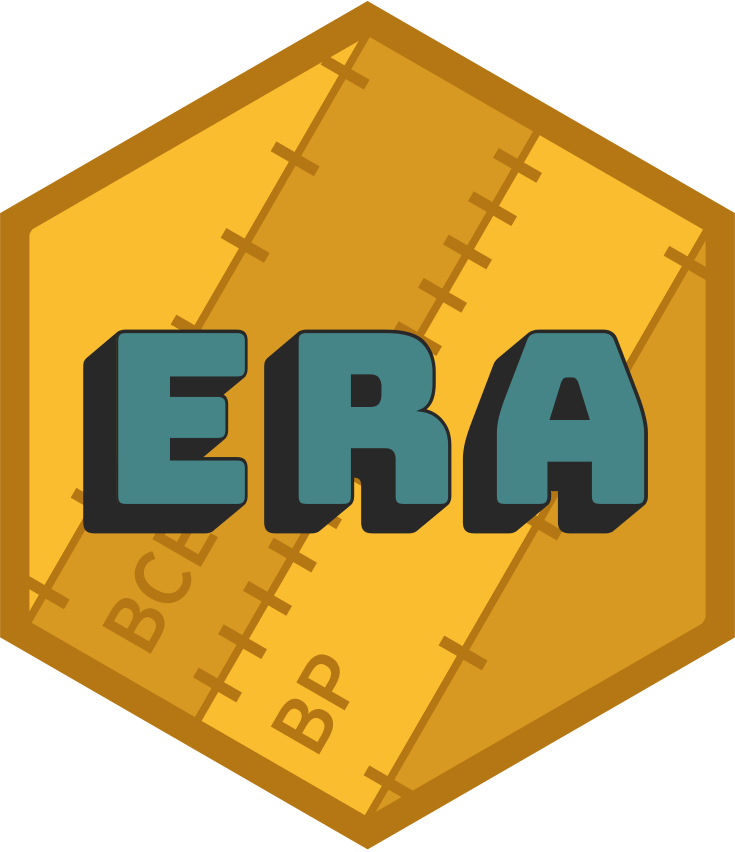

<!-- README.md is generated from README.Rmd. Please edit that file -->

# era <a href='https://era.joeroe.io'></a>

<!-- badges: start -->

[](https://www.repostatus.org/#active)
[](https://CRAN.R-project.org/package=era)
[](https://cranchecks.info/pkgs/era)
[](https://github.com/joeroe/era/actions)
[](https://codecov.io/gh/joeroe/era?branch=master)
<!-- badges: end -->

**era** is an R package that provides a consistent representation of
year-based time scales as a numeric vector with an associated *era* –
the [yr class](https://era.joeroe.io/reference/yr.html).

It includes built-in [era
definitions](https://era.joeroe.io/reference/eras.html) for many year
numbering systems used in contemporary and historic calendars
(e.g. Common Era, Islamic ‘Hijri’ years); year-based time scales used in
archaeology, astronomy, geology, and other palaeosciences (e.g. Before
Present, SI-prefixed *annus*); and support for [arbitrary user-defined
eras](https://era.joeroe.io/reference/era.html). Years can converted
from any one era to another using the generalised transformation
function
[yr\_transform()](https://era.joeroe.io/reference/yr_transform.html).

era’s classes are based on [vctrs](https://vctrs.r-lib.org/), and come
with methods for robust casting and coercion between years and other
numeric types, type-stable arithmetic with years, and pretty-printing in
tables.

## Installation

You can install the released version of era from
[CRAN](https://CRAN.R-project.org) with:

``` r
install.packages("era")
```

Or the development version from [GitHub](https://github.com/) with:

``` r
# install.packages("devtools")
devtools::install_github("joeroe/era")
```

## Basic usage

`yr()` defines the era associated with a vector of years:

``` r
library(era)
x <- yr(c(9000, 8000, 7000), "cal BP")
x
#> # cal BP years <yr[3]>:
#> [1] 9000 8000 7000
#> # Era: Before Present (cal BP): Gregorian years (365.2425 days), counted backwards from 1950
```

Use `yr_transform()` to convert between eras:

``` r
yr_transform(x, "BCE")
#> # BCE years <yr[3]>:
#> [1] 7050 6050 5050
#> # Era: Before Common Era (BCE): Gregorian years (365.2425 days), counted backwards from 0
```

Many common calendar systems and time scales are predefined (see
`?eras()`) and can be referenced by their abbreviated labels. Other eras
can be defined using the `era()` function directly.

For further usage, see the [package
introduction](https://era.joeroe.io/articles/era.html)
(`vignette("era")`).
